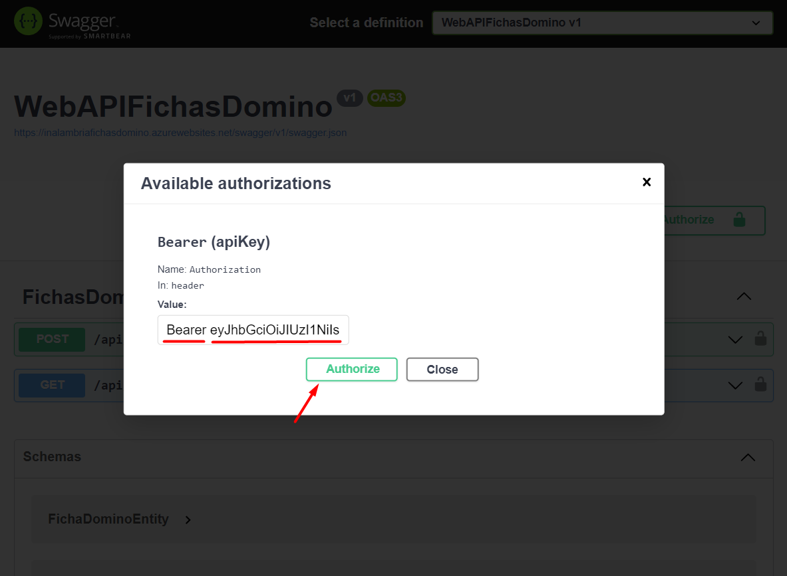

# API Ordenamiento Fichas de Domino

Proyecto desarrollado como prueba Técnica para aplicar a la vacante de Desarrollador Semi Senior para la empresa **Inalambria Internacional**

#### Documento de la prueba

Para ver el documento del Ejercicio Técnico Para Cargo Ingeniero De Desarrollo Semi-Senior, dar clic en el siguiente enlace [Ver Prueba Tecnica Desarrollador](Documentation/PruebaDeveloper.pdf "Ver Prueba")

#### Herramientas  🛠️
* Visual Studio Community 2022
* NET 6.0
* C#
* JWT
* Swagger
* New Relic
* Microsft Azure

#### Guía de uso de la API
En está guía tendrá el paso a paso de como puede realizar el uso de la API

* Abrir un navegador web e ingresar a la dirección Web ***https://inalambriafichasdomino.azurewebsites.net/swagger*** donde por medio de Swagger podrá hacer uso del proyecto. De igual manera encontrará la documentación de las API respectivas.        

* Se debe realizar la solicitud del Token que permite el acceso a la API de Ordenamiento de Fichas. Para esto debe seleccionar api/fichasDomino/solicitarToken y dar clic en el botón [Try it Out]

* Se activa la opción para realizar el llamado a la API, dar clic en el botón [Execute]

* Como resultado se obtiene una respuesta de tipo Json en el cuál el atributo **token** contiene la llave para acceder a la API. Debemos copiar el valor de dicho atributo.

* Dirigirse al inicio de la pagina y ubicar el botón [Authorize], dar clic en este.

* En esta ventana ubicar el recuadro donde se debe ingresar el token, pero antes se debe escribir la para **Bearer**, dar un espacio y ahí si pegar el token. Dar clic en [Authorize].

* Dirigirse a la API de tipo POST. Para esto debe seleccionar api/fichasDomino/ordenarFichas y dar clic en el botón [Try it Out]

* Se habilita el recuadro para escribir el cuerpo de la solicitud, en este debe reemplzar la palabra string por la combinacion de las fichas de Domino.

* Una Ficha de Domino se representa de la siguiente manera [2|1] y un conjunto de fichas se digita pegado sin espacios ni separadores, como se muestra en la imagen [2|1][2|3][1|3]. Dar clic en el botón [Execute]

* En esta imagen se puede ver el cuerpo de la respuesta, donde retorna las Fichas Ordenadas, junto con un mensaje de Validación.

* En esta imagen se puede ver el cuerpo de la respuesta, donde retorna un mensaje de Validación indicando que no fue posible organizar las fichas dadas.

#### Monitoreo con New Relic
Se implementó New Relic para poder realizar monitoreo de la API.

* En este dashboard se puede apreciar el monitoreo que se realiza con dicha herramienta, el cuál visualiza los resultados validos, erroneos, cantidades de solicitudes y los intentos fallidos al no tener acceso porque no tiene el token.

#### Developer ✒️
* **Juan Polania**
